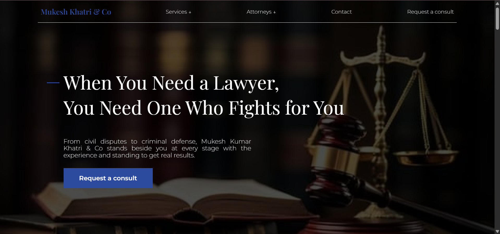

The path to making a website on my own

1.) Learned Html and Css. using this video

But what did I even learn? well...

- Html and css basics
- animations transitions and transformations
- Css display properties
- flexbox and css grid
- Nested layout techniques
- Css position
- And alotttt more.

How did I not forget?
- Did constant exercises.
## For example

|                 css position pracice                 |                       Css flex practice                  |
| :--------------------------------------------------: | :------------------------------------------------------: |
|  |                     |

## End result:

Built a copy of youtube:

Then I jumped to step 2:
Learning javascript. used this video 

I was only able to learn it partially due to time constraint but what did I learn?

- Jacascript basics
- Strings and numbers
- using html with javascript
- functions
- Booleans
- DOM
- and continuing

## And I ofcourse had to do exercises sooo

|             a cart quantity calculator               |                     A whole calculator                   |
| :--------------------------------------------------: | :------------------------------------------------------: |
|          |               |

## End result:

Built a working rock paper scissors game:

## Last step: Build a website on my own. 
- Firstly a mind map.
- Decided to copy another website for now and I know it is unorignal. However I feel like copying is also no easy task with how long each thing took.
- The main reason I decided to copy for my first website to build confidence and to show that a single person can copy with exact precision of a team of 10 people.
- Anyway the hardest part was everything. Had to learn animations and transition. Had to learn to use flex and grid in ways I couldn't even think of.
- AND the time constraint.
- Ultimately I created MukeshKumarKhatri&Co.

## Features
- As you scroll throughout the website you would be intrigued by the transitions and animations making it look more professional.
- Each practice area and attorney has their own page which can accessed through the navigation bar on the top or you can also access those pages through multiple learn more links.
- A genuine working form and make sure to fill all the details to send it.
- Each element in the website was given custom appearance and features.
