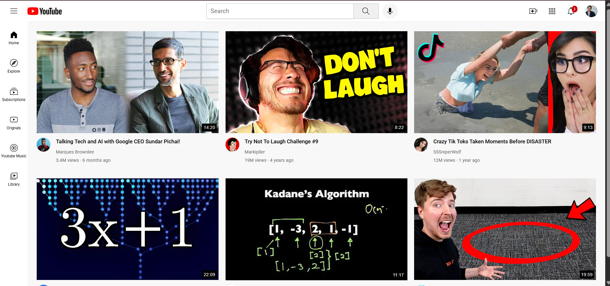
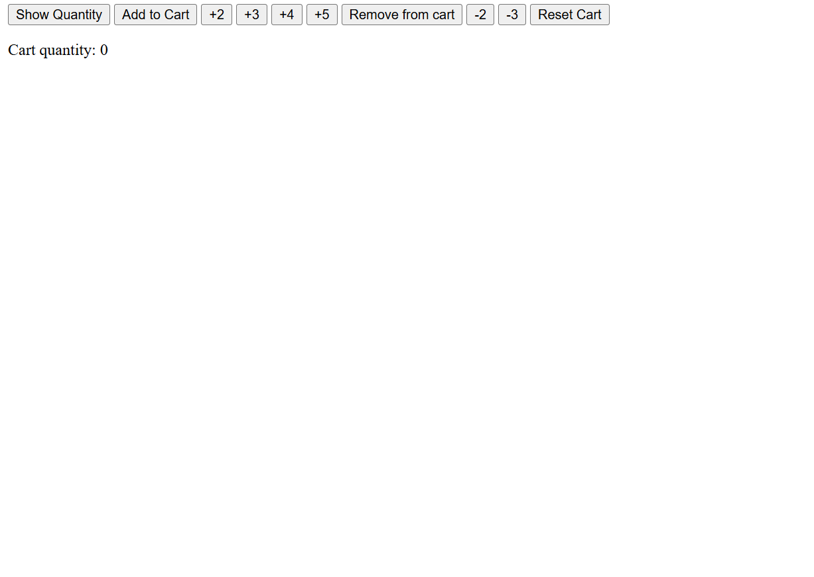
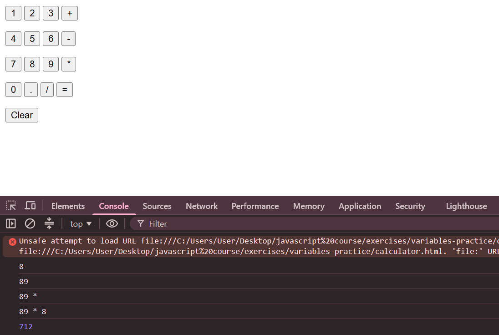
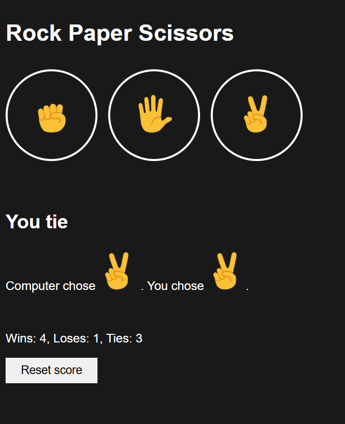

The path to making a website on my own

1.) Learned Html and Css. But what did I even learn? well...

- Html and css basics
- animations transitions and transformations
- Css display properties
- flexbox and css grid
- Nested layout techniques
- Css position
- And alotttt more.

How did I not forget?
- Did constant exercises.
## For example

|                 css position pracice                 |                       Css flex practice                  |
| :--------------------------------------------------: | :------------------------------------------------------: |
|  |                     |

## End result:

Built a copy of youtube:

Then I jumped to step 2:
Learning javascript.
I was only able to learn it partially due to time constraint but what did I learn?

- Jacascript basics
- Strings and numbers
- using html with javascript
- functions
- Booleans
- DOM
- and continuing

## And I ofcourse had to do exercises sooo

|             a cart quantity calculator               |                     A whole calculator                   |
| :--------------------------------------------------: | :------------------------------------------------------: |
|          |               |

## End result:

Built a working rock paper scissors game:

